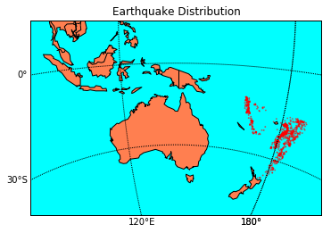

# 题目一：中国领土地图可视化


## 题目描述

请使用python (+Basemap)可视化完整的中国领土的地图（陆地和海洋）。使用至少3种不同的投影方法，必须包括conformal, equal area, equal distance (Azimuthal) projections。在使用Basemap函数时，需要注释说明调用的函数中的各个参数的意义。

## 解答

- 从 http://www.gadm.org/download 下载具体的中国省份的shape信息，解压后放到当前目录下。


```python
import numpy as np
import matplotlib.pyplot as plt
from mpl_toolkits.basemap import Basemap

def myChina(proj):
    plt.figure()

    # 参数介绍如下：
    #     projection：表示规定的投影方法，墨卡托投影（Mercator Projection），广泛应用谷歌地图。
    #     llcrnrlat：所需地图域左下角的纬度（度）Latitude。
    #     urcrnrlat：所需地图域的右上角的纬度（度）Latitude。
    #     llcrnrlon：所需地图域左下角的经度（度）Longitude。
    #     urcrnrlon：所需地图域（度）的右上角的经度Longitude。
    #     ref:https://matplotlib.org/basemap/users/merc.html?highlight=merc%20projection
    if proj=='merc':
        m = Basemap(projection=proj, llcrnrlat=-5, urcrnrlat=55, llcrnrlon=65, urcrnrlon=147, 
                    lon_0=104, lat_0=23)    # 创建一个只显示中国地区的地图
        
    # 参数介绍如下：
    #     projection：表示规定的投影方法，亚尔勃斯投影（Albers Projection），常用于表现国家疆域面积大小的图示中。
    #     lat_1 is first standard parallel.
    #     lat_2 is second standard parallel.
    #     lon_0,lat_0 is central point.
    #     ref: https://matplotlib.org/basemap/users/aea.html?highlight=albers%20projection
    elif proj=='aea':
        m = Basemap(width=8000000, height=7000000, projection=proj, 
                    lat_1=50, lat_2=60, lon_0=104, lat_0=23)
        
    # 参数介绍如下：
    #     projection：表示规定的投影方法，等距离投影（Azimuth Projection），常被用于导航地图。
    #     lon_0,lat_0 is central point.
    #     ref: https://matplotlib.org/basemap/users/aeqd.html?highlight=projection
    else:
        m = Basemap(width=8000000, height=7000000, projection=proj, 
                    lon_0=104, lat_0=23)

    m.drawcoastlines(linewidth=1) # 把海岸线画上
    m.drawcountries(linewidth=1)  # 画出国家 线宽为1.5
    m.fillcontinents(color='coral',lake_color='aqua')  # 给地图上色
    m.drawmapboundary(fill_color='aqua')

    parallels = np.arange(-90, 90, 10.) 
    m.drawparallels(parallels, labels=[1,0,0,0], fontsize=10) # 绘制纬线
    meridians = np.arange(-180.,181.,20.)
    m.drawmeridians(meridians, labels=[0,0,0,1], fontsize=10) # 绘制经线
    m.readshapefile('CHN_adm_shp/CHN_adm1', 'states', drawbounds=True)  # 画出国家具体的省份

    proj_dict = {'merc':'Mercator Equal Angle', 'aea':'Albers Equal Area', 'aeqd':'Azimuthal Equal Distant'}
    plt.title(proj_dict[proj] + " Projection")
    
    plt.show()
```


```python
myChina('merc')
myChina('aea')
myChina('aeqd')
```


# 题目二：地震数据可视化


## 题目描述

请使用地震数据（从 http://www.r-project.org 下载，叫quakes数据），使用地图可视化的方法对数据进行可视化，展现地震的地点。

## 解答

用地震的级数来决定散点图的大小，级数越大，散点越大，暂时没有用到震深和地震站数两个指标。


```python
import numpy as np
import matplotlib.pyplot as plt
from mpl_toolkits.basemap import Basemap
import pandas as pd

#########  数据生成  #########
posi = pd.read_csv("quakes.csv")

lat = np.array(posi["lat"])                         # 获取维度值
long = np.array(posi["long"])                        # 获取经度值
depth = np.array(posi["depth"], dtype=float)         # 获取震深，转化为numpy浮点型
meg = np.array(posi["mag"], dtype=float)             # 获取级数，转化为numpy浮点型
stations = np.array(posi["stations"], dtype=float)   # 获取地震站数，转化为numpy浮点型

size=(meg/np.max(meg))    # 绘制散点图时图形的大小，如果之前meg不转换为浮点型会没有大小不一的效果

#########  作图过程  #########
m = Basemap(width=12000000,height=8000000, projection='stere', 
            lat_0=-20, lon_0=140)

m.drawcoastlines(linewidth=1) # 把海岸线画上
m.drawcountries(linewidth=1)  # 画出国家 线宽为1.5
m.fillcontinents(color='coral', lake_color='aqua')  # 填充大陆
m.drawmapboundary(fill_color='aqua')

x, y = m(long, lat)

m.scatter(x, y, s=size, color='r', alpha=0.5)

parallels = np.arange(-90, 90, 30.) 
m.drawparallels(parallels, labels=[1,0,0,0], fontsize=10) # 绘制纬线
meridians = np.arange(-180.,181.,60.)
m.drawmeridians(meridians, labels=[0,0,0,1], fontsize=10) # 绘制经线

plt.title("Earthquake Distribution")
plt.show()
```





# 题目三：GDP数据动态可视化


## 题目描述

请使用世界各国GDP总量数据（从 http://www.gapminder.org 网站下载），在地图上实现显示世界各国GDP在20年来的动态变化。建议显示数据中的所有国家，或者至少超过10个以上的国家的数据。

## 解答

1. 见Question3/GDP_anim.py，GDP_anim的视频。（该动画为简单的折线图）
2. 以及Question3/GDP_map_anim.py，GDP_map_anim的视频。（该动画为地图上世界各国GDP的动态变化，其中散点代表GDP的相对大小，GDP最高的size为1，也可以更改为绝对大小，用颜色深浅区分再利用Colorbar来显示绝对GDP大小，只是我认为在这里使用相对大小更为合理）


**注**：因为我是用Mac录屏，所以保存的视频格式为Mov，不知道其他系统能否打开，若不能，还麻烦助教请再次运行一次代码。
