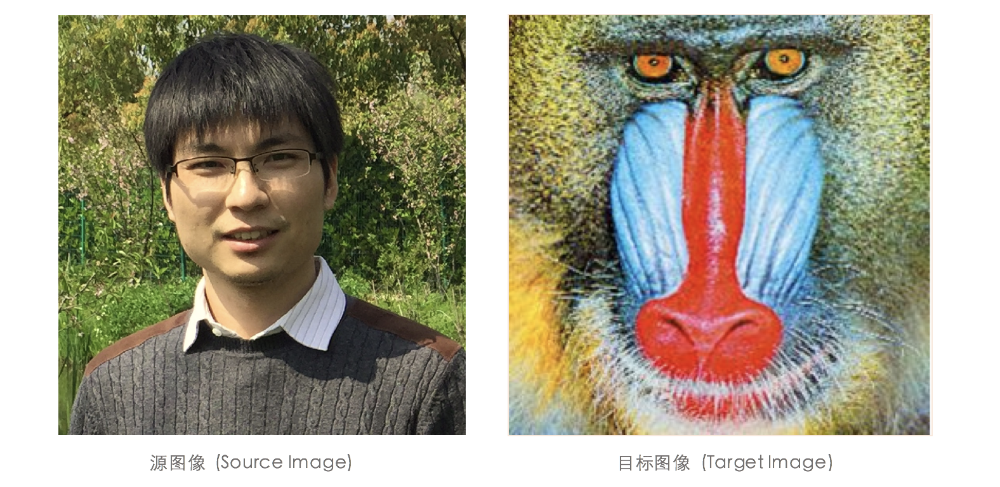

# 数据可视化作业5

---

**姓名：** 王艺楷、冉诗菡、何占魁

**学号：** 153071XXXXX、15307130424、51307130175

---

## 任务：局部仿射

>编程实现基于对应关键点的人脸到狒狒脸的形变。提交内容包括：
>
>1. 报告：在报告中清晰描述问题和数据，数据处理的各个步骤及中间结果，代码结构，开发环境，可执行文件使用手册等细节问题；要求在报告中说明每位同学的贡献和工作内容。
>2. Python 代码和可执行文件；代码要有非常清晰的注释。
>3. 数据（如果有用到）。

#### 一、问题和数据：

1. ##### 问题描述：

   在本任务中，庄老师图像被视为源图像(Source Image)称为$S$，狒狒的图像作为目标图像(Targe Image)，称为$T$。通过在图像$S$和$T$中标定对应点或区域，使源图像$S$变形得到和目标图像$T$相似图形结构。从两个角度入手，问题可形式化定义为：

   -  **寻找映射$f$：**已知点或区域集合为$C_S=\{c_1…c_n | c_i \in S.coords\}$与$C_T=\{c_1…c_n | c_i \in T.coords\}$ 。对于$T$图像的任一坐标点$c_T\in T.coords$，如何定义$f: c_T\rightarrow c_S $的映射关系$f$，使得形变图像$T'$具有优秀的效果？
   -  **寻找标定$C$：**已知对于$T$的任意点映射关系$f: c_T\rightarrow c_S$，此处$c_T\in T.coords$且$c_S\in S.coords$。如何定义对应点或者区域的集合 $C_S=\{c_1…c_n | c_i \in S.coords\}$与$C_T=\{c_1…c_n | c_i \in T.coords\}$ ，使得形变图像$T'$具有优秀的效果？

2. ##### 数据描述：

   数据为两张图片：

   -  **源图像：**庄老师的肖像照 `zxh-ape.jpg`
   -  **目标图像：** 狒狒的“肖像照” `ape.png`




#### 二、数据处理：

1. ##### 算法描述：

   算法思想为**局部仿射**，即**对于标定区域进行局部变换，对于非标定区域实现各局部变换的加权。**算法具体步骤可描述为：

   -  给定点或区域的集合$C_S=\{c_1…c_n | c_i \in S.coords\}$与$C_T=\{c_1…c_n | c_i \in T.coords\}$ 。
   -  遍历目标图像$T$的每一个坐标$c_T\in T.coords$，通过映射$f$获取对应的坐标$c_S\in S.coords$。情况为：

   $$
   c_S = f(c_T)=\left\{
   \begin{aligned}
   &G_i(c_T), & c_T\in C_T,& i=1...n \\
   &\sum^n_{i=1}w_i(c_T)G_i(c_T), & c_T \not \in C_T,&w_i(c_T)=\frac{{d_i(c_T)^{-e}}}{\sum^n_{i=1}{d_i(c_T)^{-e}}} \\
   \end{aligned}
   \right.
   $$

   -  设$h(c, I)$为图像$I$坐标点$c$取其像素值的函数，则对于$\forall  c_T\in T.coords$，都能获取像素值$ h(f(c_T), S)$。
   -  设$T'$为与$T$的尺寸相同的图像，对于$\forall c_T\in T.coords$将$h(c_T, T')$赋值为$h(f(c_T), S)$。由于$f(c_T)$获得的坐标值可能为非整数，因此$h(c,I)$需要插值处理。
   -  若为灰度图像，则重新进行灰度值归一化。得到图像的图像$T'$则为形变图像。

2. ##### 图像处理：

   -  **通道选取：** 因为该任务的目标图像 `ape.png`有四个通道(R, G, B, alpha)，源图像`zxh-ape.jpg`有三个通道(R, G, B)，因此选取前三个通道:

      ```python
      from skimage import io
      # 读取图片
      srcImage = io.imread("zxh-ape.jpg")
      tarImage = io.imread("ape.png")[...,:3]
      ```

   -  **标记点选取：** 我们通过 `PyLab` 的标定函数`ginput()`标定了两张图片的对应点。为了探究标记点疏密程度对局部仿射算法的影响，我们人工标注了稀疏和稠密两套标记点集合：


#### 三、代码结构：


#### 四、开发环境：


#### 五、可执行文件使用 


#### 六、合作者贡献

